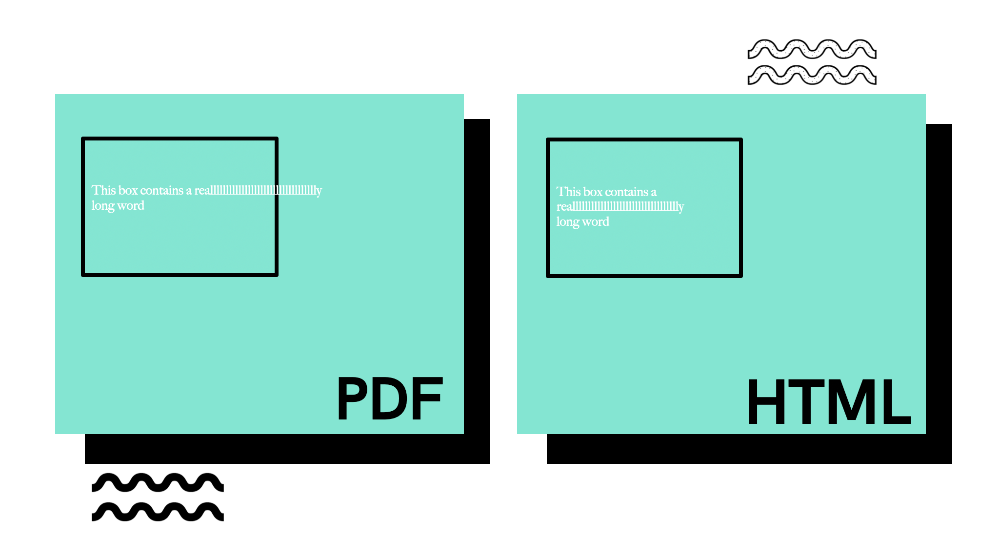

# Text Wrap Challenge

Welcome! This is repository is associated with the Atorus blog post you can find right [here](#TODO). We're eager to see your solutions! 

After each blog post in this series is released, this repository will be updated. Each post has its own folder, and you can find the initial post within the [baseline](./baseline/) folder of this repository. We all have different environments, so you can find what I have used in the file [sessionInfo.txt](./sessionInfo.txt)

Here are the submission instructions.

- Create your own [fork](https://docs.github.com/en/get-started/quickstart/fork-a-repo) of this repository
- Develop your own solution within your personal repository. Use [submission_template.Rmd](./submission_template.Rmd) as a guide
- When you're done, submit a [pull request](https://docs.github.com/en/github/collaborating-with-pull-requests/proposing-changes-to-your-work-with-pull-requests/creating-a-pull-request-from-a-fork) from your fork. Make sure you fill out the solution template, but we're happy to receive any other write up you have explaining the solution that you've implemented. 

Go forth and code, and we're excited to see what you come up with! 
