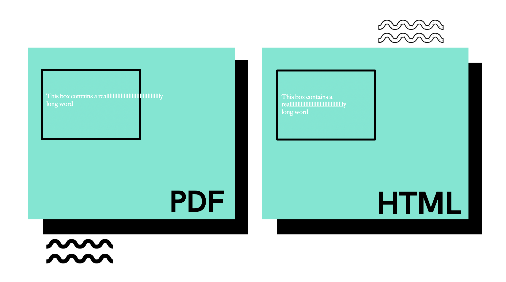

```{r setup, include=FALSE}
library(stringr)
library(purrr)
library(stringi)
load('../benchmarks.Rdata')
knitr::opts_chunk$set(echo = TRUE)
```


Let's have some fun. 

This is the first post of a series. In this first post, I’m going to present a problem and lay out some guidelines. In subsequent posts, I'll walk through several different solutions to this problem - my solutions. **But you - the reader - I challenge you to do better**. And when you do, share your solution! Some friendly competition is always a good time.

_To share your solution, follow the instructions in the README of our [GitHub Repo](https://github.com/atorus-research/text_wrap_challenge) and in future posts we'll feature them on our site! You can also find all the code associated with this post within that repository_


# Some Background

The R world is filled with a number of wonderful packages. For example, if you want to create beautiful tables there are several different solution, including my two favorites [{huxtable}](https://hughjonesd.github.io/huxtable/) and [{gt}](https://gt.rstudio.com/). Particularly in the world of HTML, these packages make creating tables incredibly easy, and as the user you don't need to think about any of the messy bits that have to happen under the hood. 

When you get into the land of PDF and RTF, things become - well. Less fun. Advances in the packages available have taken away a lot of ugly challenges, particularly with everything that R Markdown has to offer. But every now and then, something creeps up that just **drives you mad**. Which brings us to the today's topic - word wrapping!


   
In my career, I've seen this question come up a number of times. Ideally, you want text to wrap at the word - meaning that when your text overflows into a new line, the split between those two lines happens at some whitespace between two words. Many formats handle this for you, such as HTML and even RTF. Some organizations use flat text, and in those cases you might need (and I've seen it done) to fully implement this from scratch. 

Unfortunately, there are cases where the built in solutions can fail. Some clinical reports can become pretty crowded, be it an Adverse Events table with long AE descriptions - or most recently for us, PDF outputs. One of the latest quirks we dealt with at Atorus was long running strings in a single cell of a table that was knit to PDF. To get creative and solve this problem, we decided to create our own workaround on the data processing side. Which brings us to...

# The Challenge

This is a *data processing* problem. So let's start with some data:

```{r example data, echo=FALSE}
text <- c(
   "Pneumonoultramicroscopicsilicovolcanoconiosis is a really long word", 
   "It's a name that has been invented for a lung disease caused by breathing in very small pieces of ash or dust", 
   "Pneumono refers to the lung. Ultra means extremely, microscopic means tiny, silica is sand, volcano is self-evident, and coniosis is scarring.")

knitr::kable(text,
   col.names='text'
)
```

Great - we've got some long strings to play with. So what's our goal? Imagine you're trying to squeeze these strings into a cell of a report that's smaller than it should be. So small, in fact, that the cell width is smaller than the longest word within the string. This is where we hit our own personal challenge. So here are the rules:

- If enough space is available, the string should be wrapped at the word.
- If a single word exceeds the allotted width, that word should be split using hyphenation (-)

Historically, at least in the SAS&reg; world, splitting at the word was the hard part. It's a complex problem to solve! But in the R world we get extremely elegant solutions to this that are easy to implement using {[stringr](https://stringr.tidyverse.org/index.html)} (and {[stringi](https://stringi.gagolewski.com/)} under the hood).


What we don't get is the second point: hyphenated line splitting of long words. At least - I couldn't find an available solution myself. And so begins the challenge: **write a function that meets the above two requirements**. For consistency, I'll add two more:

- The API to the function should be (at least):
  - `text`: A character text vector
  - `width`: Maximum width of any given line
- The function should be vectorized - so as noted above, the `text` parameter should take in a vector of any length

Given the list of strings that I have above, assuming `width=10`, you can check your work against these solutions:

```{r solutions}
solutions <- c("Pneumonou-\nltramicro-\nscopicsil-\nicovolcan-\noconiosis\nis a\nreally\nlong word",
               "It's a\nname that\nhas been\ninvented\nfor a lung\ndisease\ncaused by\nbreathing\nin very\nsmall\npieces\nof ash or\ndust",
               "Pneumono\nrefers to\nthe lung.\nUltra\nmeans\nextremely,\nmicroscop-\nic means\ntiny,\nsilica\nis sand,\nvolcano\nis self-\nevident,\nand\nconiosis\nis\nscarring.")
```


## Baseline

In the spirit of competition, we should first establish a baseline that we want to compare against. As mentioned earlier, I'm going to lean on the {stringr}/{stringi} implementations for wrapping at the word, and this will serve as a fair baseline - because all of my updates will sit on top of those functions.

Let's use the example set of text here as our test set. Furthermore, we'll see as we go through my solutions that I'm also interested in how these functions perform when vectorized over potentially many rows. For example, you might want to apply this function during pre-processing of a dataframe before feeding into your table styling packages. To test this, I'll repeat the text vector to give me a few thousand elements. 

```{r baseline bench, eval=FALSE, warning=FALSE}
base_bench <- microbenchmark::microbenchmark(
   str_wrap(rep(text, 1000), width=10),
   unit='s'
   )

microbenchmark:::autoplot.microbenchmark(base_bench)+
   ggplot2::theme_bw()
```

```{r show baseline results, echo=FALSE, warning=FALSE, message=FALSE}
microbenchmark:::autoplot.microbenchmark(base_bench) +
   ggplot2::theme_bw()
```

Note that this method is _incredibly_ efficient. This is the power of the {stringi} package, which implements this wrapping algorithm in C under the hood. But as we move forward, remember that to process about 3000 strings, the baseline is only about .04 seconds (but be sure to test on your own machine!).

Alrighty - tune in next week to see my first solution. After that, I have three more solutions that progressively make improvements, which I’ll be posting each week. So go! Off to the races! Give this a try, and we look forward to seeing your solutions!

As a reminder - you can submit your solutions in our [GitHub](https://github.com/atorus-research/text_wrap_challenge) which has submission instructions in the README.
